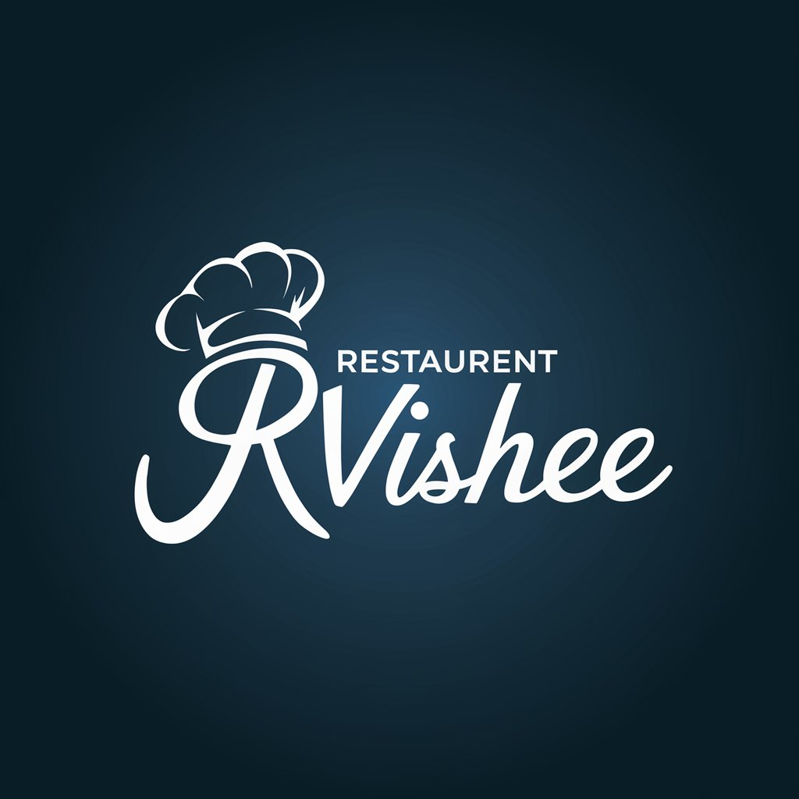

# RVshee Restaurant

(https://66d3a99575f6ce9d315b81aa--sparkling-platypus-fd867a.netlify.app/image0.jpeg)

## The Project
[**View the deployed site**](https://66d3a99575f6ce9d315b81aa--sparkling-platypus-fd867a.netlify.app/)

RVshee is a modern, responsive website that showcases the offerings of a vibrant restaurant. The site is designed to highlight the restaurant's unique culinary experience, providing users with an intuitive and engaging platform to explore the menu, make reservations, and learn more about the restaurant's story.

## The Context

This website was created as part of a web development project, aiming to build a professional online presence for RVshee Restaurant. The inspiration came from a desire to combine aesthetic appeal with functionality, creating a site that not only attracts potential customers but also enhances their interaction with the brand. This project demonstrates the creator's ability to design and develop a sophisticated, user-friendly website tailored to the needs of a dynamic restaurant business.

## The Team

The following contributors have worked on this project:

  * [Contributor Name] **[Github](https://github.com/contributor1)** , **[Twitter](https://twitter.com/contributor1)**
  * [Contributor Name] **[Github](https://github.com/contributor2)** , **[Twitter](https://twitter.com/contributor2)**
  * [Contributor Name] **[Github](https://github.com/contributor3)** , **[Twitter](https://twitter.com/contributor3)**

## Project Guide

Explore the key features of the RVshee Restaurant website:

